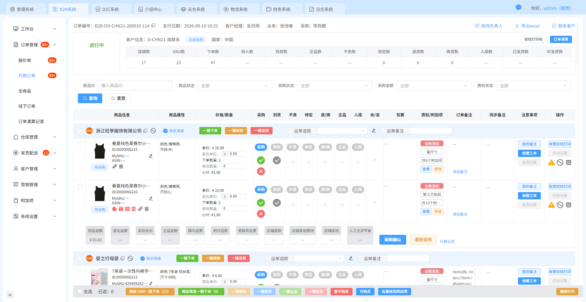
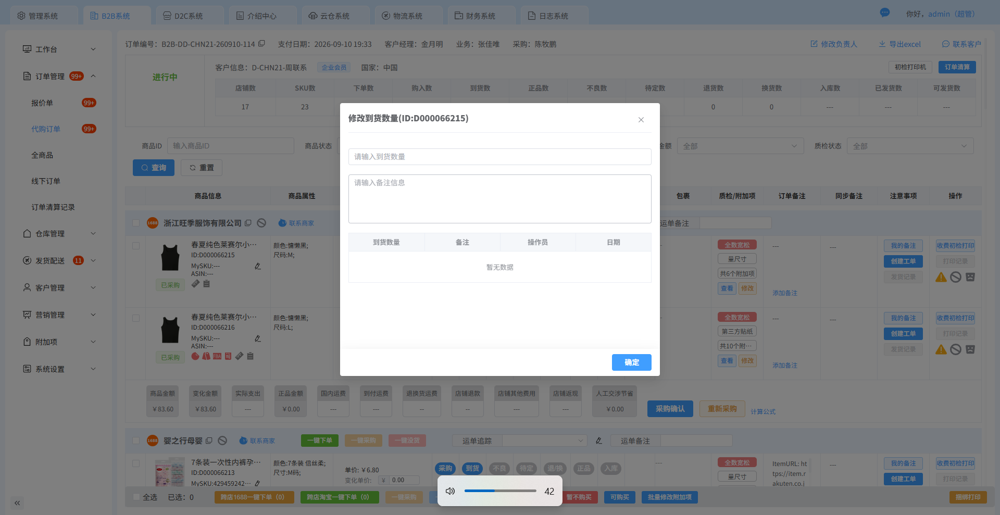
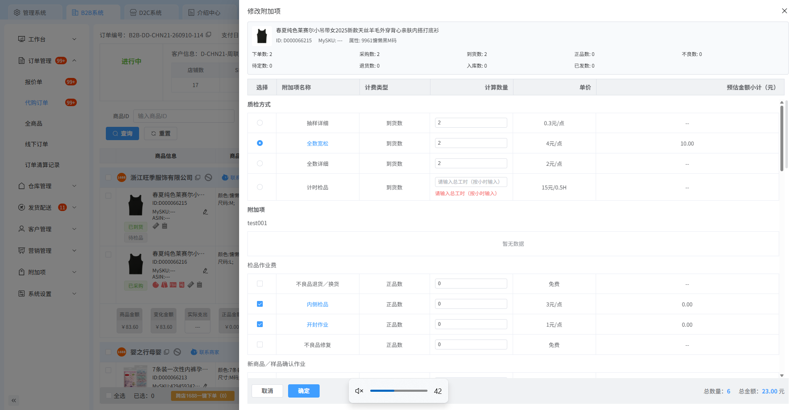

# PC 端附加项报工设计方案（V2.0 · 可交互原型版）

依据：本目录四张后台截图（订单列表、订单详情、到货弹窗、附加项修改页）、现有 PRD 及业务方后续确认。本版完善 PC 工作台、订单快捷报工和员工数据模块，并交付无后端 HTML 交互原型。截图用于还原视觉结构，不能证明原系统接口行为。

## 0. 最新业务定位（业务方已确认，优先于早期方案）

本期建设的是**质控人员工作量与产量记录能力**。现行系统继续负责清算，两套业务口径独立运行，关联相同商品和已选项目，但不相互替代。

| 维度 | 现行清算逻辑 | 新增报工逻辑 |
|---|---|---|
| 核心问题 | 选了哪些服务、按什么数量清算 | 谁做了什么附加项、实际做了多少 |
| 默认行为 | 到货后默认检品完成；正品后默认已选附加项完成 | 只有明确提交人员报工，才产生人员产出记录 |
| 数量依据 | 检品方式下四个选项按到货数；其他附加项按正品数 | 当前首版附加项仍以正品为可报上限，各项目独立累计 |
| 状态 | 沿用已有完成/清算状态 | 未报工、部分报工、已报齐、数量待核对 |
| 结果影响 | 继续执行现有清算与流转 | 只更新报工流水和人员产出，不回写清算数量、金额或完成状态 |

到货10、正品8时，检品方式对应计算数量10，内侧检品、开封作业等附加项计算数量8。当前默认完成的清算状态可以与“报工未记录”同时存在，这不是数据错误。

“剩余未报”只表示尚未归属到人员报工记录的数量，不证明实物尚未处理。不能以没有报工为由新增清算、尾检、入库、打包或发货拦截。报工数量异常只拦截本次报工，不影响原清算流程。

PC 与小程序是同一报工系统的两个入口，共用累计与流水；这里的“两套方案”是清算与报工，不是PC与小程序各一套。

## 1. 推荐结论

**首版同时提供独立「质控报工」模块和订单商品行快捷报工入口。PC 与小程序都支持登记人员产出。**

```text
质控报工
├─ 报工工作台：跨订单扫码/手输商品，逐项登记
├─ 员工产量：日期×员工×附加项汇总，下钻明细
└─ 报工明细：逐笔追溯商品、数量、人员与来源

订单管理 → 代购订单列表 → 订单详情 → 商品行附加项报工抽屉
```

到货数量弹窗继续承担到货记录；附加项修改页继续承担客户服务选项和计费配置。独立报工抽屉记录实际作业完成量，三个动作入口相邻、职责分开。

独立工作台承担连续报工，订单抽屉承担当前商品快捷报工，两处共用表单、校验与记录，不需要重复登记。进入“质控报工”时以报工工作台为主要操作入口；人员产量和明细服务集中查询。

以上是推荐方案，尚未作为正式批准的 PC 页面需求。

## 2. 三个现有页面的判断

| 步骤/页面 | 现状判断 | 对报工设计的意义 |
|---|---|---|
| 1. 代购订单详情 | 商品图片、ID、规格、到货/正品等数量及附加项入口已在同一行，上下文完整；但列和按钮较密集 | 适合放商品级报工入口，不适合直接塞入整套报工表单 |
| 2. 到货数量弹窗 | 标题明确是修改到货数量，包含数量、备注、操作员和历史记录 | 可参考其“本次输入+历史记录”思路，但不能复用为附加项报工，因为到货不等于正品 |
| 3. 附加项修改页 | 已有商品摘要，主体是服务选择、计费类型、计算数量、单价、金额；质检方式与其他项目混合展示 | 商品摘要和宽抽屉形式可复用；配置和收费输入不能当作已做数量 |

业务方已进一步确认：到货触发检品默认完成，正品触发所选附加项默认完成，这是当前清算口径。报工读取正品作为数量上限，但不据此自动生成任何员工的产出。截图不能验证具体接口，接口仍需开发核实。

## 3. 报工放在哪里：方案比较

| 位置 | 优点 | 问题 | 建议 |
|---|---|---|---|
| 到货数量弹窗中增加报工 | 复用已有数量录入习惯 | 将到货和实体附加项混成一次动作；无法容纳多项目和四类预览 | 不采用 |
| 修改附加项页内直接增加已做/本次 | 已有项目和商品摘要 | 服务选项、计费数量与实际完成量易混淆；一个“确定”按钮含义不清 | 不作为首版方案 |
| 商品行新增入口，独立报工抽屉 | 保留当前订单上下文；不污染配置；关闭后继续下一商品 | 需要一个新抽屉和商品行入口 | **首版推荐** |
| 独立报工工作台 | 支持跨订单扫码、直接登记人员产出 | 需要独立页面，但复用商品报工能力 | **首版提供，与订单快捷入口并存** |

菜单截图仅显示“附加项”一级菜单，未展开子项，不能确认其中是否已有任务、打印或作业入口。本版按用户方向新增独立“质控报工”模块，不把现有“附加项”清算配置菜单当作报工入口。

## 4. 订单详情页怎么改

### 4.1 商品行入口

根据补充截图「代购订单详情页-报工和报工记录.png」，商品行采用以下入口布局：

1. **服务信息**：保留质检方式及已选附加项概览。
2. **报工进度**：增加独立文案，例如“报齐 2/6 项 · 4 项待报”。这里 6 是可报工任务数，不能直接复制现有“共6个附加项”的配置计数。
3. **配置**：「质检/附加项」列保留「查看配置」，本原型仅只读展示。
4. **报工记录**：位于「注意事项」列的「发货记录」下方，点击打开当前商品抽屉的记录页签。
5. **附加项报工**：位于最右「操作」列，与左侧「报工记录」对齐，点击打开当前商品报工抽屉。

两个入口均使用紧凑蓝色描边文字按钮；截图中的红框红字为批注，不作为正式界面配色。原型补齐「同步备注」「注意事项」列以匹配截图结构，长表格支持横向滚动。备注、创建工单、发货记录和打印为原系统入口，本原型禁用展示并注明未实现。

### 4.2 入口状态

| 情况 | 商品行文案/入口行为 |
|---|---|
| 正品大于 0，存在剩余 | 「报工」主入口，显示待报任务数 |
| 正品为 0 | 提示“暂无可处理正品”；可进入查看任务/预览，提交不可用 |
| 所有任务报齐 | 显示“数量已报齐”；入口改为“查看报工”，仍可查看记录和预览 |
| 正品增加 | 根据最新数据重新计算，恢复“报工”并显示剩余 |
| 无可报工项目 | 显示“无需附加项报工”，不伪装为已做完 |
| 数量或配置异常 | 显示“待核对”，进入查看原因，不允许直接越过校验 |

本版提供独立的“报工状态”筛选：待报、部分报工、数量已报齐、待核对；不复用截图已有的“质检状态”。

## 5. 独立报工抽屉怎么设计

建议在现有抽屉组件基础上设计宽抽屉，1920px 桌面参考宽度约 1000–1200px；实际随可用空间适配，较窄窗口切全宽。避免照搬整张配置表。

### 5.1 布局

```text
附加项报工                                         关闭
商品图片 / 商品 ID / 名称 / 规格 / 订单号
当前正品 7 件    数量已报齐 2/6 项    刷新数据
正品数量发生更新时，在此显示提示

[当前报工] [报工记录]

项目列表（左侧）                      当前选中项目（右侧）
项目   可报总量  累计已报  剩余未报  状态          贴纸
贴纸     7     5     2   部分报工      作业说明
吊牌     7     0     7   未报工        预览入口 / 标签内容区域
洗标     7     7     0   数量已报齐    本次完成数量 [-] 2 [+]
FBA      7     0     7   未报工        [填入剩余 2 件]
……                                    实际处理人、确认
                                      凭证（按项目配置）

固定底部：关闭                           提交贴纸报工
```

数字仅为布局示例，不使用截图中的真实订单、员工或客户信息作为新增模拟数据。

### 5.2 为什么采用左右布局

PC 能同时展示任务概览和当前单项表单：左边回答“哪些项目还有数量未报”，右边回答“现在报哪一项、报多少”。减少在长配置表中上下滚动查找。

每次仅提交一个项目，其他行只读。不要首版就提供多项目、多商品勾选后“一键全部报工”，否则各项目真实完成量、处理人和提交结果难以确认。

### 5.3 四类预览

贴纸、吊牌、洗标、FBA 均在当前项目中提供预览。优先在抽屉右侧展开，提供放大阅读；避免“抽屉上弹窗，再弹窗”的多层界面。

如需大图，可使用一层图片查看器，关闭后恢复表单。文件缺失、加载失败必须分别反馈；预览行为不增加累计，不替代打印或实体完工。

### 5.4 报工记录

与当前报工共用商品摘要，在抽屉内使用第二个页签展示：项目、本次数量、实际处理人、提交时间、来源 PC/小程序、凭证。来源标识是建议新增，用于追溯，不区分业务数量口径。

有未提交输入时切记录页签可保留草稿；关闭抽屉、切换商品或切换当前项目时，提示继续填写或放弃，不能静默丢弃。[设计建议]

## 6. PC 操作流程

### 6.1 从订单进入的常规流程（首版）

1. 打开代购订单详情，定位具体商品。
2. 点击该商品行“报工”，打开独立抽屉并加载最新正品和任务。
3. 左侧选择尚未报齐的项目，右侧核对作业要求；四类设计项目可预览。
4. 实物作业完成后填写本次完成量，确认实际处理人。
5. 点击明确命名的“提交××报工”。
6. 成功后原位反馈“本次已报 2 件，累计 7，剩余 0”，更新左侧报工进度及背景商品行的报工摘要，不更新清算完成状态。
7. 留在当前商品，人员选择下一个项目；本次报工登记结束后关闭抽屉处理其他商品。

PC 无需每笔提交后跳到独立成功页。保留上下文和本次结果，更适合连续操作。不要成功后立即自动替人员选中并填好下一项目，避免连点报错项。

### 6.2 小程序与 PC 交叉作业

两端使用同一商品/项目任务与同一有效报工记录来源。小程序报 5 后，PC 应读到累计 5；PC 补 2 后，小程序刷新应读到累计 7。不能分别维护一套已报数量。

两端并发时按最新正品和累计校验；相同请求重试不能重复记账。PC 不能因为是后台就跳过正品限制或允许任意覆盖累计。

### 6.3 正品增加后的续报

正品 7、贴纸累计 7 → 上游确认增加到 9 → 商品行重新显示待报 → 抽屉贴纸剩余 2 → 本次报 2 → 产生新记录，累计 9。**修改到货数量本身不能直接触发可报量增加**，必须以有效正品更新为依据。

若填写期间正品或累计发生变化，显示最新剩余并要求复核；不默默修改人员输入的本次数量。

### 6.4 失败与异常

提交失败保留输入；结果未知先确认同次请求结果。正品减少至累计以下时按待核对处理，不能直接删除历史。预览加载失败不谎报成功。已报项目后续配置变更需提示影响，不用“修改附加项”覆盖报工事实。

## 7. 两个现有弹层的职责

### 到货数量弹窗

保留“到货数量 + 备注 + 到货历史”的独立流程，不增加附加项提交。可另行优化明确字段标签和输入语义，但仅凭截图不能判定该字段保存的是本次新增量还是修改后的总量；需核实后再调整。

### 附加项修改页面

保留客户选择服务、计费数量、单价和预估金额。不要在保存配置时自动报工，不把“计算数量”改名为“已做数量”。

已存在报工后取消或替换项目，建议显示关联记录提示并进入既定核对流程；具体变更规则需单独确认。暂不引入主管角色或权限划分。

## 8. 第一版建议交付范围

**必做**：独立报工工作台；商品行报工入口与独立状态；报工抽屉；四类预览；逐项报工；历史记录；人员产量明细与基础汇总；与小程序同源数据；最新正品及并发校验；增量重新开放。

**暂不做**：独立任务中心、跨商品批量报工、班组排名、工资成本、报工冲销、到货报工合并、修改配置与报工合并、真实生产中的数量模拟按钮。

PC直接报工已纳入首版，不再仅限订单内快捷入口。独立工作台与订单抽屉并存；不额外增加生产任务领取、锁定工位、派工或计时流程。

## 9. 人员产量查询（本次目标对应的必要设计）

独立「质控报工」模块包含「员工产量」与「报工明细」两个查询页，配合「报工工作台」形成登记—汇总—追溯闭环。这里不是派工、领取或生产调度中心。原型中作为左侧一级模块展示。

### 9.1 查询与展示

- 筛选：日期、实际处理人、附加项、商品 ID；订单号和来源PC/小程序作为辅助筛选。
- 明细：商品、附加项、本次报工数量、实际处理人、提交账号、报工时间、来源、凭证。
- 汇总：按“日期 × 实际处理人 × 附加项”合计有效报工数量，可展开对应明细核对。
- 本版先统计报工件数/作业件次，不直接核算工资、计件金额、工时效率或排名。

### 9.2 示例与计算口径

同一商品正品8件：员工甲贴纸5件、员工乙贴纸3件、员工甲开封作业8件。

| 实际处理人 | 附加项 | 报工产量 |
|---|---|---:|
| 员工甲 | 贴纸 | 5件 |
| 员工甲 | 开封作业 | 8件 |
| 员工乙 | 贴纸 | 3件 |

贴纸累计8件；员工甲合计13作业件次，不能显示为13件不同实物。清算侧继续按自身规则处理正品8件，不因员工人数或报工笔数变化重复收费。

正品8→10，只扩大各项目可报上限，不给任何员工自动增加2件产量。只有新增报工记录成功后才计入对应人员。

### 9.3 防止统计失真

- 报工归属实际处理人，不能把代录账号当作劳动贡献者。
- 成功记录累计，同次请求重复提交不重复计数；PC与小程序合并去重。
- 默认完成、到货记录、正品变化、预览或打印都不自动计人员产出。
- 当前采用报工时间汇总时应明确名称为“当日报工量”。如果允许补录过去作业，建议分别记录作业日期和提交时间，口径经确认后再提供“实际作业日产量”，不能把今天补录一律算作今天实际生产。
- 历史没有人员证据时保留为未报/历史未归属，不平均分配、不归给系统账号。上线统计起点及补录办法需要明确。
- 报齐表示该项目当前可报数量已分配到有效记录，不代表报工系统重新判定清算完成。

## 10. 截图证据与局限

以下按本次阅读顺序排列，是用户提供的截图，不是已完成的实际点击流程。

### 1. 代购订单详情：上下文完整，操作区较密



可见“质检/附加项”列已包含项目概览与查看/修改；这是新增商品级报工入口的直接依据。小字、密集图标与多个相邻操作提示存在误点风险，建议新增报工使用明确文字，不再堆无文字小图标。

### 2. 到货数量弹窗：职责清晰，输入语义仍需核实



可见数量、备注及历史表格。数量输入依赖占位提示，建议保留输入后的可见字段标签。截图无法验证校验提示、键盘焦点、提交后是否关闭或数据如何累计。

### 3. 附加项修改页：适合配置，不宜承接作业报工



可见服务选择、计费类型、计算数量、单价、金额，且含质检方式。多个滚动区域和长列表使作业定位成本较高。报工应提取可执行的已选项目，不将所有计费行、质检方式或分组标题自动变成报工任务。

截图无法验证屏幕阅读器语义、键盘可操作性、真实加载/失败状态、权限或系统联动。本方案是截图基础上的布局与流程建议，不是完整产品可用性或无障碍验收。

## 11. 本版页面与交互交付

### 11.1 页面矩阵

| 页面 | 可交互内容 | 范围边界 |
|---|---|---|
| 代购订单列表 | 国家/客户/订单/等级/商品/店铺/支付日筛选、订单状态页签、分页、进入详情/记录 | 保留截图布局；使用8个模拟订单，不复刻原真实订单数据 |
| 代购订单详情 | 商品/报工状态筛选；商品行打开报工抽屉、配置、到货记录 | 报工不修改清算；旧采购/入库等动作不展开 |
| 附加项报工抽屉 | 切项目、数量增减、一键剩余、处理人确认、凭证、预览、记录页签、提交 | 与工作台同一表单与账本；有脏表单时退出提示 |
| 报工工作台 | 手输/模拟扫码、键盘Enter查询、下一商品、同一报工能力 | Enter仅查询，不提交报工；不依赖订单查找 |
| 员工产量 | 日期/人员/项目/商品/订单/来源筛选；汇总卡；分组下钻；导出CSV | 按提交日期统计，不称工资或实际作业日产量 |
| 报工明细 | 同类筛选、逐笔详情、来源标记、CSV导出 | 只读，不提供删除或改历史 |
| 四类预览弹窗 | 模拟加载、放大缩小、失败重试、缺失反馈、返回保留表单 | 标签为明确标注的示意，不生成实际条码，不打印 |
| 到货记录弹窗 | 展示到货数量和历史 | 原截图是“修改到货数量”；本次只读参考，不改变既有数量语义 |
| 附加项配置抽屉 | 商品摘要、四种检品方式按到货数、已选附加项按正品数 | 原截图为可修改页；本次只读展示，避免擅自重建清算配置保存逻辑 |
| 评审工具 | 正品+2/减少、模拟小程序报工、明确失败/响应丢失、预览失败/未生成、重置 | 非正式用户功能，后续产品实现需移除 |

### 11.2 工作台与抽屉细则

- 实际处理人默认演示员工，可切换；切换后取消确认勾选，防止错误归属。无岗位权限划分。
- 本次数量为正整数，可填部分量。可报总量暂按该项目适用正品数，每个项目独立计算累计与剩余。
- 四类预览不影响数量。拍照项单张凭证必填仅为当前原型假设，其他项目选填；正式凭证配置另行确认。
- 成功后留在当前项目，清空本次输入及人员确认，展示本次+q、最新累计与剩余；不自动提交下一项。
- 切商品、切项目、离开页面或关闭抽屉，有未提交内容时询问是否放弃。切记录页签/预览保留草稿。
- 提交中锁定编辑和导航。明确失败保留草稿，未写入；响应丢失场景先查询原请求结果，避免重复记账。
- 数据版本变化需复核最新数；禁止静默截断本次输入。数量不足时提示具体剩余。
- 正品减少冲突只限制报工，不影响原系统清算或流转。

### 11.3 员工产量与明细下钻

默认查询当天提交的报工记录。汇总按日期、实际处理人、附加项分行；每行展示数量、笔数、涉及商品与最近时间。“查看明细”保留原筛选并增加该分组条件；明细页提供“返回员工产量”，恢复汇总筛选。

跨项目合计标为作业件次；不把不同服务量合计称为独立实物数量。导出使用当前已展示的结果，避免输入尚未查询的筛选条件改变导出内容。

### 11.4 视觉还原策略

沿用截图的浅蓝色顶栏、多系统页签、白底侧栏、蓝色激活项、浅灰表头、细边框表格和紧凑按钮；主色参考 #409EFF，侧栏约205px、顶栏48px。1920px为主要参考宽度，1366px可用；长订单表格保留横向滚动，较窄窗口工作台转上下布局。

商品缩略图引用原订单详情截图中的商品区域，不复用截图里的客户姓名和真实订单作为模拟数据。标签缺少真实预览来源，采用标注“DEMO”的内容示意。尚未取得真实预览、菜单子项和实际系统页面行为时，不声称像素级完全还原。

## 12. 原型文件与走查

入口：[PC HTML交互原型](pc-prototype/index.html)。用浏览器直接打开，无需安装、构建或后端。index.html、styles.css、model.js、app.js需保持同目录；原商品截图位于上一级目录。

初始展示订单列表以对照截图；左侧“质控报工 → 报工工作台”进入独立PC操作。报工数据使用浏览器本地存储，存储不可用时提示仅当前页面保留。

推荐路径：
1. 订单列表 → 第一个订单详情 → 商品DDEMO001“附加项报工”。
2. 贴纸可报8、已报5、剩余3；本次报3 → 已报齐，员工产量新增3。
3. 切换到员工产量 → 当前人员/贴纸汇总 → 查看明细 → 打开新增记录。
4. 工作台查询同商品，验证与订单抽屉读取同一累计。
5. 评审工具模拟正品+2；贴纸重新开放2，员工产量暂不增加；再提交才计产量。
6. 查询DDEMO003看暂无正品；DDEMO004看无附加项。
7. 四类预览、失败重试、并发模拟、未知提交结果确认、CSV导出分别走查。

两端共用服务端记录是正式方案要求。当前PC原型只在一个演示账本中模拟PC/小程序来源，并未与旧小程序HTML建立真实跨端共享后端；不要把本地模拟当成接口联调完成。

## 13. 验收清单与未覆盖项

- 订单快捷抽屉和独立工作台都可提交，互相看到最新结果。
- 上限8已报5只能再报3；正品增至10后可继续增量。
- 已报齐、无正品、无项目、数据冲突、未确认人员、非法数量分别有可理解状态。
- 四类预览均可进入，返回不丢表单，预览不计产量。
- 多人分次报工按实际处理人归属，PC与模拟小程序数据汇总一致。
- 重复请求不重复记录；明确失败不写入；响应丢失可查询已成功结果。
- 报工不修改清算金额/数量/默认完成状态，未报工不阻止现行流转。
- 员工产量筛选/分组下钻/返回及明细导出可用。
- 原清算配置修改、真实打印、退换货办理、工资与排名不在本次原型范围。
- 真实浏览器视觉/键盘/文件上传验收情况见 [design-qa.md](pc-prototype/design-qa.md)；逻辑自检不能替代真实浏览器验收。

