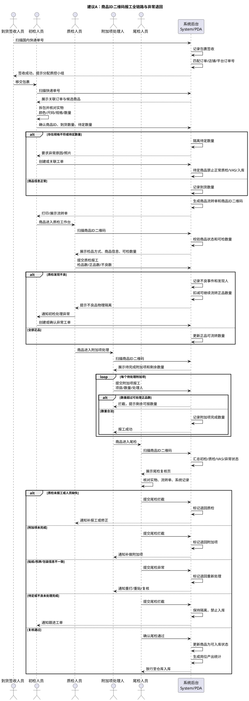

# 建议 A：商品 ID 二维码报工与 QC/VAS 数字化第一版方案

版本：v0.2 优化稿  
日期：2026-09-05  
适用范围：国内包裹签收后的初检、质检、附加项处理、尾检、入库前放行，以及对应员工产出统计。  
核心对象：代购订单明细商品 ID，例如 `D000010471`。  
文档定位：本文件是建议 A 的业务与系统方案稿，用于产品、现场、开发、管理层评审；详细开发任务应另行拆分。

---

## 0. 一页结论

建议 A 可行，但必须明确边界：

```text
快递签收不等于商品到货确认；
商品 ID 二维码不替代国内快递单号；
商品 ID 二维码应作为初检确认后的商品级流转与 QC/VAS 报工入口；
初检负责到货与待定隔离，质检负责检品与不良发现，附加项处理人负责实际完成记录，尾检负责复核、拦截和放行。
```

第一版不要试图推翻现有现场分工，也不要一步到位做复杂工单系统。更稳的做法是：

```text
保留当前“快递签收 -> 分配质控小组 -> 初检 -> 质检 -> 附加项 -> 尾检 -> 入库”的实物流转；
把纸质流转单上的商品 ID、二维码、质检工号、不良数、附加项勾选，逐步升级为系统扫码报工；
让尾检从“替前序岗位二次录入”转为“核对系统事实并决定放行/退回”。
```

P0 优先解决三个问题：

1. 商品流转单增加商品 ID 二维码，扫码即可进入作业页。
2. 质检和附加项处理人即时扫码报工，记录人员、数量、时间、结果。
3. 尾检按系统记录复核，发现质检未报工、附加项未完成、数量不一致、贴纸/吊牌不一致时强拦截。

---

## 1. 背景与目标

### 1.1 业务背景

跨境代购订单生成后，每个订单明细商品会拥有一个商品 ID，例如 `D000010471`。该 ID 代表“某一张代购订单中的某一款商品”，比平台商品 ID 更适合作为仓内作业索引，因为仓内 QC/VAS 处理通常跟订单明细、客户选择的检品方式、附加项、数量状态绑定。

当前现场已经有一套可运行的质控小组流程，但关键数据仍大量依赖纸质流转单、手写工号、口头反馈和尾检二次录入。这导致员工绩效、附加项完成情况、不良责任和异常追溯都存在滞后和误差。

### 1.2 方案目标

本方案目标不是增加现场负担，而是把现场已经发生的动作转化为系统事实：

1. 减少查单、找商品、翻页面、手写工号、手写勾选。
2. 记录每个商品每个节点由谁处理、处理多少、何时处理。
3. 把待定、不良、附加项未完成等风险变成系统可拦截状态。
4. 支持按员工、质控小组、附加项、商品、订单自动统计产出。
5. 让尾检成为最终质量闸口，而不是主要数据录入岗位。

---

## 2. 当前实际流程 AS-IS

以下为当前现场实际流程基线：

1. 商品到货后，先在到货中台电脑做快递签收登记，记录快递签收表。
2. 签收后的快递分散给各个质控小组，小组包含初检、质检、尾检人员。
3. 初检人员拆包裹，扫描快递单号跳转到关联的代购订单详情页，填写到货数量。
4. 填写到货数量后，如发现产品颜色、尺码、规格不符合代购订单商品信息，则创建工单，交给采购或业务处理；业务和采购判断是否沟通客户，最终决定作正品入库、作不良退换货或其它处理；不符合规格的数量填写到待定区域。
5. 初检完成后，商品随商品流转单进入质检人员工作台。
6. 质检人员根据用户在前台选择的检品方式进行处理；发现商品问题时反馈给初检人员，由初检创建工单。
7. 质检完成后，用不同颜色捆绳区分不良品和正品，其中红色表示不良。
8. 质检撕下商品流转单后半部分，后半部分包含商品 ID、不良数、商品 ID 二维码。
9. 其余附加项当前处理人不够明确，例如贴纸附加项可能由质检人员在商品流转单上用笔勾选，并手写工号。
10. 正品和不良品流转到尾检工作台。
11. 尾检人员根据商品流转单选择质检人员工号并登记不良数，登记不良品后同步更新正品数。
12. 如包含贴纸、吊牌打印，尾检人员打开商品对应打印按钮，检查贴纸、吊牌是否符合商品包装跟随信息，并检查贴纸信息、吊牌信息是否一致。
13. 尾检检查完成后，由仓库执行商品入库操作；入库操作流程后续补充。

---

## 3. 当前系统事实校准

本节用于校准“系统当前已经支持什么、缺什么”。以下结论来自当前项目代码阅读，避免把未来设想误认为现有能力。

### 3.1 国内快递签收已经支持扫码登记

后台国内快递签收页支持扫码/输入快递单号，调用签收接口，并进行成功、重复、私人物品等提示。

代码事实：`288:330:admin-all-view/src/views/b2b/depository/domesticExpress/index.vue`

### 3.2 快递签收只确认包裹到仓，不确认商品明细到货

签收接口按 `package_no` 查询或创建国内包裹签收记录，写入签收时间、签收人，并通过运单反查订单信息。它没有直接更新订单明细商品的到货数量。

代码事实：`527:573:api-all/app/admin_b2b/controller/DomesticExpressController.php`  
代码事实：`636:682:api-all/app/admin_b2b/service/DomesticExpressService.php`

### 3.3 运单关系当前未精确到商品明细和数量

`china_waybill` 当前入库参数主要包括 `seller_open_id`、`package_no`、`logistics_id`、`logistics_name`、`platform`、`platform_order_no`、`order_no` 等。当前关系可以支持“运单 -> 订单/店铺”，但不足以自动判断“运单 -> 商品 ID -> 到货数量”。

代码事实：`29:41:api-all/app/model/ChinaWaybill.php`

### 3.4 商品到货数量当前由订单明细到货接口独立处理

商品到货数量由订单明细到货接口更新，需要传入订单明细和数量；系统会更新 `arrive_qty` 与 `wait_check_qty`，写数量日志，并刷新检品/附加项数量。

代码事实：`340:417:api-all/app/admin_b2b/controller/OrderDetailUpdateController.php`

### 3.5 管理后台已有人工到货入口

订单详情页面存在“到货”按钮和“全部到货”快捷动作，仍属于人工或半人工确认入口。

代码事实：`759:793:admin-all-view/src/views/b2b/order/agentBuy/components/ShopPanel.vue`  
代码事实：`2683:2697:admin-all-view/src/views/b2b/order/agentBuy/components/ShopPanel.vue`

### 3.6 商品 ID 扫码识别具备复用基础

PDA 侧商品扫码可以解析 `1/D000010471` 或裸 `D000010471`，再按订单明细商品 ID 查询商品信息。

代码事实：`403:447:api-all/app/admin_pda/controller/OperationalGenuineController.php`

因此当前系统适合在已有能力上增强“商品 ID 二维码报工”，但不适合直接把“快递签收成功”变成“商品自动到货”。

---

## 4. 核心瓶颈与突破点

| 维度 | 当前瓶颈 | 建议 A 突破点 |
|---|---|---|
| 数据产生时机 | 质检、不良、附加项先写纸上，尾检再录入 | 作业人员现场扫码后即时记录 |
| 责任归属 | 依赖手写工号，尾检二次选择 | 系统记录实际处理人、时间、数量 |
| 数量防错 | 待定、不良、正品、附加项完成靠人工判断 | 系统按数量池强校验，超限拦截 |
| 异常追溯 | 质检发现问题后口头反馈初检 | 先记录异常发现事件，再交初检建工单 |
| 尾检角色 | 尾检既复核又代录前序数据 | 尾检只复核、拦截、退回、放行 |
| 附加项统计 | 贴纸/吊牌/剪标等靠纸面勾选 | 每项 VAS 独立报工、可统计、可追溯 |
| 包裹与商品关系 | 签收只到订单层，不能到商品数量 | 初检拆包确认商品 ID 后生成商品级流转 |

最重要的变化是：

```text
纸面记录从“唯一事实来源”降级为“实物流转辅助凭证”；
系统扫码报工升级为“岗位产出与数量状态的事实来源”。
```

---

## 5. 商品 ID 二维码设计

### 5.1 `D000010471` 是否可做二维码

结论：可行。

`D000010471` 是订单明细级商品 ID，长度短、识别稳定，适合作为商品级作业入口。它可以绑定该商品在当前订单中的图片、规格、SKU、数量、检品方式、附加项、异常、尾检状态。

### 5.2 不建议裸放 ID

不推荐二维码内容只放：

```text
D000010471
```

原因是裸 ID 无法清晰表达业务场景，系统难以判断它是商品码、VAS 报工码、搜索关键词还是其它码。

推荐编码：

| 编码 | 用途 | 建议 |
|---|---|---|
| `1/D000010471` | 复用现有 WMS 商品扫码规则 | 第一版可作为兼容格式 |
| `VAS/D000010471` | 明确进入 QC/VAS 报工页 | 推荐作为报工专用格式 |
| `2/快递单号` 或快递单号 | 国内包裹签收/包裹处理 | 不与商品报工混用 |
| `EMP/员工号` | 员工身份确认或代班切换 | 需要时扩展 |

### 5.3 推荐第一版策略

第一版建议同时支持：

```text
1/D000010471：兼容商品扫码详情和现有 WMS 识别
VAS/D000010471：进入 QC/VAS 报工工作台
```

扫码入口根据前缀分流：

```text
扫描快递单号      -> 包裹签收/订单候选
扫描 1/D000010471 -> 商品详情/初检/尾检复核
扫描 VAS/D000010471 -> 附加项与质检报工
```

---

## 6. 优化后流程 TO-BE

### 6.1 总体流程

```text
国内包裹到仓
  -> 到货签收人员扫描快递单号
  -> 系统记录快递签收，并匹配代购订单/店铺
  -> 包裹分配给质控小组
  -> 初检人员拆包并扫描快递单号
  -> 系统展示关联订单与候选商品明细
  -> 初检核对实物与订单商品信息
  -> 初检确认到货数量、待定数量、异常原因
  -> 系统生成商品流转单与商品 ID 二维码
  -> 商品进入质检工作台
  -> 质检人员扫描商品 ID 二维码
  -> 系统展示客户选择的检品方式和可检数量
  -> 质检提交正品数、不良数、问题说明
  -> 附加项处理人扫描商品 ID 二维码
  -> 系统展示待处理附加项并记录完成数量
  -> 商品进入尾检工作台
  -> 尾检人员扫描商品 ID 二维码
  -> 系统展示初检、质检、附加项、异常状态
  -> 尾检通过则释放入库；不通过则退回对应岗位
```

### 6.2 岗位 SOP

#### 到货签收人员

```text
扫国内快递单号
  -> 系统记录签收
  -> 系统匹配订单/店铺
  -> 包裹分配给质控小组
```

注意：此环节只确认包裹到仓，不确认商品明细到货。

#### 初检人员

```text
扫快递单号
  -> 拆包
  -> 核对实物颜色/尺码/规格/数量
  -> 确认商品 ID 和到货数量
  -> 填写待定数量和异常原因
  -> 生成商品流转单
```

#### 质检人员

```text
扫商品 ID 二维码
  -> 查看检品方式和可检数量
  -> 完成检品
  -> 提交检品数量、正品数、不良数
  -> 有问题时记录异常发现事件并通知初检
```

#### 附加项处理人

```text
扫商品 ID 二维码
  -> 查看待处理附加项
  -> 完成贴纸/吊牌/剪标/换包装/拍照等作业
  -> 提交完成数量和实际处理人
```

#### 尾检人员

```text
扫商品 ID 二维码
  -> 核对实物、流转单、系统记录
  -> 检查质检是否报工、附加项是否完成、数量是否一致
  -> 检查贴纸/吊牌/包装信息是否一致
  -> 通过则放行入库，不通过则退回
```

---

## 7. 数量流转模型

### 7.1 基础数量定义

| 数量 | 说明 |
|---|---|
| 到货数量 | 初检拆包后确认实际到货数量 |
| 待定数量 | 颜色、尺码、规格不符等需要业务/采购判断的数量 |
| 可质检数量 | 到货数量扣除待定数量后的数量 |
| 质检数量 | 质检人员实际完成检品的数量 |
| 质检正品数 | 质检后可继续 VAS/尾检/入库的数量 |
| 质检不良数 | 质检发现不能直接入库的数量 |
| VAS 可处理数量 | 当前可用于贴纸、吊牌、剪标、换包装、拍照等附加项的正品数量 |
| 尾检通过数量 | 通过最终复核，可释放给仓库入库的数量 |

### 7.2 核心公式

```text
可质检数量 = 到货数量 - 待定数量
质检数量 = 质检正品数 + 质检不良数
VAS 可处理数量 = 质检正品数 - 已隔离正品数 - 已退回数量
附加项累计完成数量 <= VAS 可处理数量
尾检通过数量 <= 质检正品数
```

第一版可先简化为：

```text
VAS 可处理数量 = 质检正品数
```

但必须保留未来扩展空间，例如返工、退回、客户接受不良、返修转正等。

### 7.3 示例

```text
商品 ID：D000010471
初检确认到货：10 件
初检待定：2 件，原因是颜色/尺码不符
可进入质检：8 件
质检正品：7 件
质检不良：1 件
后续贴纸/吊牌/剪标/换包装最多只能对 7 件报工
尾检通过最多 7 件
```

关键原则：

```text
初检报工可以按实际拆包检查数量统计；
后续 VAS 只能按正品可操作数量控制；
不良和待定必须隔离，不能混入正常入库流。
```

---

## 8. 功能清单

### 8.1 P0 必须落地

| 功能 | 说明 | 价值 |
|---|---|---|
| 商品流转单二维码 | 初检确认后生成 `1/D000010471` 或 `VAS/D000010471` | 后续岗位统一扫码入口 |
| 扫码商品作业页 | 扫码展示商品图片、规格、订单、数量、检品方式、附加项 | 减少查单和误选 |
| 初检到货与待定记录 | 初检记录到货数量、待定数量、原因 | 把异常先隔离 |
| 质检扫码报工 | 质检记录检品数量、正品数、不良数、实际人员 | 产出实时化 |
| 附加项扫码报工 | 贴纸、吊牌、剪标、换包装、拍照独立报工 | 明确 VAS 责任 |
| 尾检扫码复核 | 尾检核对系统记录与实物/纸单一致性 | 从代录变闸口 |
| 基础拦截 | 未质检、附加项未完成、数量不一致时不允许尾检通过 | 防漏做 |
| 基础统计 | 按人员、日期、项目、商品汇总产出 | 自动统计绩效基础 |

### 8.2 P1 增强

| 功能 | 说明 | 价值 |
|---|---|---|
| 异常发现事件 | 质检发现问题时先记录事件，再交初检建工单 | 追踪发现人和发现时间 |
| 拍照凭证 | 不良、规格不符、贴纸/吊牌异常要求照片 | 降低争议 |
| 贴纸/吊牌一致性校验 | 尾检核对商品信息、包装信息、贴纸/吊牌信息 | 防贴错/挂错 |
| 退回闭环 | 尾检退回质检或附加项，处理后再次尾检 | 避免口头返工 |
| 工位模式 | 初检、质检、附加项、尾检分别简化页面 | 降低操作复杂度 |

### 8.3 P2 规划

| 功能 | 说明 | 价值 |
|---|---|---|
| 计件绩效规则 | 配置不同岗位和附加项的计件口径 | 自动核算绩效 |
| 成本归集 | 将 VAS 人工和耗材成本归集到订单 | 支持利润分析 |
| SLA 看板 | 统计签收到初检、质检、尾检、入库时长 | 找瓶颈 |
| 自动派工 | 按小组/工位/优先级推荐任务 | 提升调度效率 |
| 入库闭环 | 尾检通过后与仓库入库状态打通 | 全链路可追踪 |

---

## 9. 页面与交互优化

### 9.1 通用设计原则

1. 扫码优先，尽量不让现场人员手动搜索订单。
2. 页面按岗位显示最少必要信息，不展示无关字段。
3. 数量输入大字体、高对比，支持快捷加减和“一键剩余数量”。
4. 状态用颜色和短语表达：可操作、已完成、待定、不良、需退回、可入库。
5. 异常原因尽量做成快捷标签，减少文字输入。
6. 提交后给出明确反馈：成功、重复、超限、待处理、退回原因。

### 9.2 初检工作台

核心展示：

```text
快递单号、订单号、店铺、商品图片、商品 ID、颜色/尺码/规格、应到数量、已到数量、待定数量、异常原因。
```

核心操作：

```text
确认到货、填写待定、创建/关联工单、打印商品流转单。
```

### 9.3 质检工作台

核心展示：

```text
商品 ID、商品图片、客户选择的检品方式、可质检数量、已质检数量、剩余数量。
```

核心操作：

```text
全部正品、有不良、提交并下一件、记录异常事件、上传照片。
```

### 9.4 附加项工作台

核心展示：

```text
待处理附加项、每项应做数量、已做数量、剩余数量、是否需要尾检复核。
```

核心操作：

```text
完成当前剩余、填写完成数量、上传凭证、扫描/核对贴纸吊牌。
```

### 9.5 尾检工作台

核心展示：

```text
初检到货数、待定数、质检人员、质检正品数、不良数、附加项完成状态、贴纸/吊牌状态、是否可入库。
```

核心操作：

```text
尾检通过、退回质检、退回附加项、退回初检、标记贴纸/吊牌异常、补打流转单。
```

---

## 10. 异常处理逻辑

| 异常场景 | 触发环节 | 系统处理 | 流转结果 |
|---|---|---|---|
| 快递单号无法匹配订单 | 签收/初检 | 标记未匹配包裹，进入人工认领或私人物品处理 | 不进入商品到货 |
| 快递单号匹配多个订单 | 初检 | 展示候选订单，由初检选择 | 人工确认后继续 |
| 包裹内多款商品 | 初检 | 逐个商品确认到货数量，逐个生成流转单 | 分商品流转 |
| 颜色/尺码/规格不符 | 初检 | 填写待定数量、原因，创建/关联工单 | 待定隔离 |
| 到货少于采购数量 | 初检 | 记录部分到货，剩余继续等待或采购处理 | 部分流转 |
| 到货多于采购数量 | 初检 | 要求说明并进入异常待确认 | 暂不放行超出部分 |
| 质检发现不良 | 质检 | 记录不良数量、问题、发现人，通知初检工单 | 不良隔离 |
| 质检未报工到尾检 | 尾检 | 禁止通过，退回质检补报工 | 退回质检 |
| 附加项未完成 | 尾检 | 禁止通过，退回附加项处理 | 退回 VAS |
| 附加项报工超限 | 附加项 | 阻止提交，提示剩余可报数量 | 原岗位修正 |
| 贴纸/吊牌信息不一致 | 尾检 | 标记异常，退回重打/重贴/复核 | 退回 VAS |
| 商品流转单丢失 | 任意环节 | 按商品 ID、快递单号或订单号补打，记录原因 | 继续流转 |
| 工号错误 | 报工/尾检 | 组长或管理员更正并保留记录 | 更正后继续 |
| 网络/扫码异常 | 任意环节 | 允许临时手输商品 ID 或离线记录，恢复后补同步 | 风险标记 |

---

## 11. 全链路顺序图



---

## 12. 绩效统计口径

### 12.1 核心原则

```text
员工绩效统计按“实际完成动作”记录；
商品流转控制按“当前可流转数量”判断；
不良、待定、返工等异常动作单独记录，不与正常正品流混算。
```

### 12.2 典型统计口径

| 岗位/动作 | 计入口径 | 数量来源 |
|---|---|---|
| 初检 | 拆包并确认到货/待定的数量 | 初检提交记录 |
| 质检 | 完成检品的数量 | 质检报工记录 |
| 质检发现问题 | 不良/异常发现数量 | 质检异常事件 |
| 贴纸 | 实际贴纸完成数量 | 附加项报工记录 |
| 吊牌 | 实际吊牌完成数量 | 附加项报工记录 |
| 剪标 | 实际剪标完成数量 | 附加项报工记录 |
| 换包装 | 实际换包装完成数量 | 附加项报工记录 |
| 拍照 | 实际拍照商品数或照片数 | 附加项报工记录 |
| 尾检 | 完成复核并放行/退回的数量 | 尾检记录 |

### 12.3 管理看板建议

1. 今日签收包裹数。
2. 今日初检商品数和件数。
3. 今日质检商品数、件数、不良率。
4. 今日附加项完成数，按项目和人员统计。
5. 今日尾检通过数、退回数、退回原因。
6. 当前待定未处理数量。
7. 当前不良待处理数量。
8. 当前待入库数量。
9. 员工产出排行。
10. 质控小组产能排行。

---

## 13. 防错与拦截规则

### 13.1 必须拦截

| 场景 | 拦截位置 | 处理 |
|---|---|---|
| 快递签收未匹配订单 | 初检确认到货前 | 人工认领后再处理 |
| 商品 ID 不存在或无法识别 | 质检/VAS/尾检扫码 | 不允许报工，提示重扫或补打 |
| 待定数量未出工单结论 | 质检/VAS/尾检/入库 | 隔离待定数量 |
| 质检未报工 | 尾检 | 退回质检 |
| 不良数量未确认 | 尾检/入库 | 退回或等待工单 |
| 必做附加项未完成 | 尾检/入库 | 退回附加项岗位 |
| 附加项完成数量超正品可操作数量 | VAS 报工 | 阻止提交 |
| 贴纸/吊牌与商品信息不一致 | 尾检 | 退回重打/重贴 |

### 13.2 可人工放行但需记录

| 场景 | 放行条件 |
|---|---|
| 客户接受轻微瑕疵 | 工单有结论，尾检复核通过 |
| 待定商品改判正品 | 初检/业务/采购结论明确，必要时重新质检 |
| 少量数量差异 | 有主管权限、原因、记录 |
| 纸质单丢失后补打 | 有补打原因和操作人 |

---

## 14. 第一版数据对象建议

本节只描述业务对象，不展开具体 SQL。

### 14.1 商品 QC/VAS 汇总对象

用途：按商品 ID 汇总当前流转状态。

建议字段：

```text
商品ID、订单号、快递单号、到货数量、待定数量、可质检数量、质检数量、正品数量、不良数量、VAS可处理数量、尾检状态、当前节点、最后操作人、最后操作时间。
```

### 14.2 报工流水对象

用途：记录每次实际作业产出。

建议字段：

```text
商品ID、订单号、作业类型、附加项类型、报工数量、正品数量、不良数量、待定数量、实际处理人、登录操作人、工位、小组、凭证、报工时间、幂等标识。
```

### 14.3 异常事件对象

用途：记录规格不符、质检不良、贴纸/吊牌异常等发现事实。

建议字段：

```text
商品ID、异常类型、异常数量、发现岗位、发现人、发现时间、照片、说明、当前处理状态、关联工单、最终处置结果。
```

### 14.4 尾检复核对象

用途：记录尾检通过/退回/异常。

建议字段：

```text
商品ID、复核人、复核时间、复核数量、复核结果、退回岗位、退回原因、贴纸/吊牌校验结果、是否放行入库。
```

---

## 15. 第一版接口能力建议

本节只描述能力，不限定具体技术实现。

| 能力 | 说明 |
|---|---|
| 扫商品 ID 获取作业信息 | 返回商品、订单、数量、检品方式、附加项、异常状态 |
| 初检确认到货 | 记录到货数量、待定数量、异常原因，并生成流转单 |
| 质检报工 | 记录检品数量、正品数、不良数、质检人员、问题说明 |
| 附加项报工 | 记录附加项类型、完成数量、处理人员、凭证 |
| 尾检复核 | 检查前序完成状态，允许通过或退回 |
| 异常事件记录 | 记录发现人、数量、问题类型，并可关联工单 |
| 产出统计 | 按人员、日期、岗位、附加项、商品、订单汇总 |

---

## 16. 实施路线图

### 16.1 P0：扫码报工 MVP

目标：让商品 ID 二维码成为现场主入口，并把质检/附加项/尾检关键数据采集起来。

交付内容：

1. 商品流转单增加商品 ID 二维码。
2. 商品扫码作业页。
3. 初检到货与待定记录。
4. 质检扫码报工。
5. 附加项扫码报工。
6. 尾检扫码复核与基础拦截。
7. 基础员工产出统计。

建议试点：选择一个质控小组、两到三个高频附加项，例如贴纸、吊牌、拍照。

### 16.2 P1：异常与防错增强

目标：减少错放行、漏做、错贴、错挂。

交付内容：

1. 质检异常事件与初检工单联动。
2. 不良/待定/贴纸吊牌异常拍照凭证。
3. 贴纸/吊牌一致性校验。
4. 尾检退回闭环。
5. 工位端大字体、语音提示、快捷操作。

### 16.3 P2：绩效与成本

目标：把现场报工转化为管理与财务能力。

交付内容：

1. 计件规则配置。
2. 员工绩效日报。
3. 小组产能排行。
4. 附加项人工成本统计。
5. 附加项耗材成本归集。
6. 订单成本与毛利分析。
7. 签收到入库全链路时效看板。

---

## 17. 验收标准

| 验收项 | 标准 |
|---|---|
| 商品二维码 | 扫 `1/D000010471` 或 `VAS/D000010471` 可进入正确商品作业页 |
| 包裹边界 | 快递签收不会自动确认商品到货 |
| 初检确认 | 初检可记录到货数、待定数、异常原因 |
| 待定隔离 | 待定数量不会进入正常质检/VAS/入库 |
| 质检报工 | 质检人员可记录检品数、正品数、不良数 |
| 附加项报工 | 贴纸、吊牌、剪标、换包装、拍照可记录处理人和数量 |
| 数量校验 | 后续 VAS 累计完成数量不得超过正品可处理数量 |
| 尾检复核 | 未报工、未完成、数量不一致、贴纸吊牌异常时不可通过 |
| 绩效统计 | 可按人员/日期/作业类型统计完成数量 |
| 追溯 | 可按商品 ID 查看全流程节点、异常、人员、时间 |

---

## 18. 待确认问题

1. 商品流转单应在初检确认到货后打印，还是到货签收后预打印、初检再修正？建议第一版在初检确认后打印，降低误打风险。
2. 商品 ID 二维码第一版采用 `1/D000010471`、`VAS/D000010471`，还是两者同时支持？建议两者同时支持，逐步引导到 `VAS/` 专用码。
3. 质检人员是否允许直接记录异常事件？建议允许记录发现事实，但正式工单仍由初检按现有规则创建或确认。
4. 附加项处理人以登录账号为准，还是允许扫描员工工牌切换实际处理人？现场混岗时建议支持员工工牌。
5. 尾检是否允许修改前序人员和数量？建议默认不允许直接改，只能退回；组长/管理员可以带原因更正。
6. 待定商品经工单判定为正品入库后，是否必须重新质检？建议至少需要尾检复核，高风险品类重新质检。
7. 入库环节是否要强制校验尾检通过、附加项完成、不良/待定已隔离？建议作为入库反馈补充时的核心规则。
8. 贴纸、吊牌、剪标、换包装、拍照的计件单位分别按件、SKU、张数还是套数？需要管理层确认绩效口径。

---

## 19. 最终建议

建议 A 应按“先轻后重、先采集后自动化、先复核后结算”的路径推进。

第一阶段不要急于自动派工、自动结算工资或完全取消纸质单。真正应该优先做的是：

```text
让每个商品有一个稳定二维码入口；
让每个岗位在完成动作时顺手扫码记录；
让系统自动校验数量边界；
让尾检根据系统记录强拦截或放行；
让管理端能看到人员产出和商品处理进度。
```

这样改造的价值最直接：现场操作更轻，质检准确率更高，尾检压力更小，绩效统计从人工汇总变为系统自动生成。
